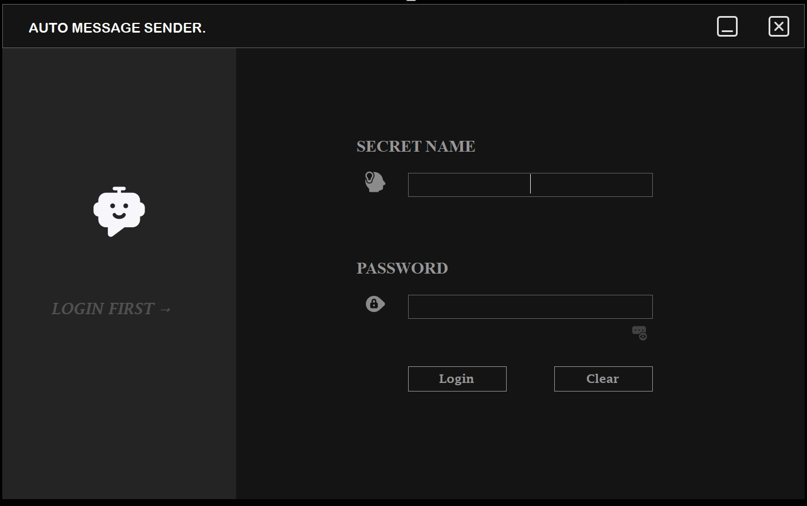
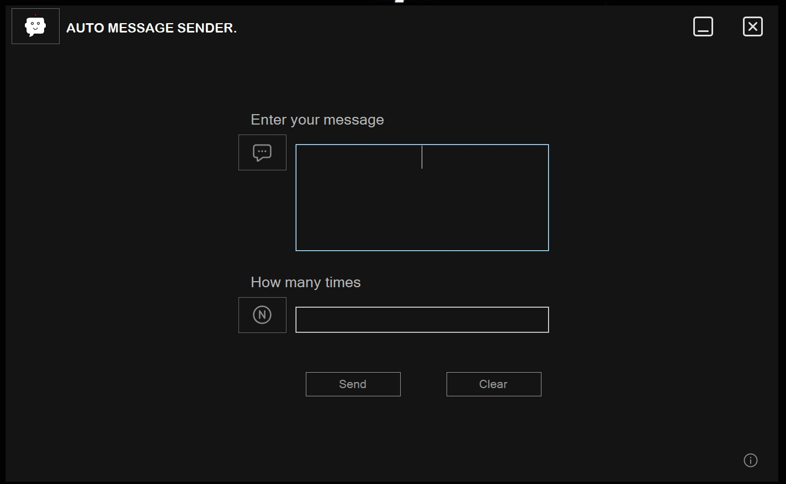

# Auto Message Sender

Auto Message Sender is a Windows Forms application that allows users to automatically send a predefined message multiple times. It comes with an intuitive interface and helpful notifications during the process of sending messages.

## Features
- Automatically send the same message multiple times.
- A countdown notification (5 to 1) before starting the sending process.
- Error validation for empty message fields and invalid input for the number of messages.
- Clear and simple interface.

## Screenshots

### Login part
If you double click inside that logo here you will get this application secret name and password-_-

### Main Part

## Installation

### Requirements:
- Windows OS
- .NET Framework (4.8 or higher)

### Installation Steps:

1. Download AutoMsgSetup.exe file from the repository.
2. Run the `AutoMsgSetup.exe` file to launch the application.
3. # ENJOY +_+

## Usage

1. **Open the application**: Once installed, open the Auto Message Sender application.
2. **1st Login**: Login with secret name and password.
3. **Enter your message**: Type the message you want to send repeatedly in the message field.
4. **Specify the number of times**: In the `Number of Messages` field, enter how many times you'd like the message to be sent.
5. **Click the Send button**: Once you're ready, click the "Send" button, and the app will show a countdown before sending the messages automatically.
6. **Confirmation**: After all the messages are sent, you'll receive a "Message sent successfully" notification.

## Author
This project was developed by MJ Joy. 

## License
This project is licensed under the MIT License.

